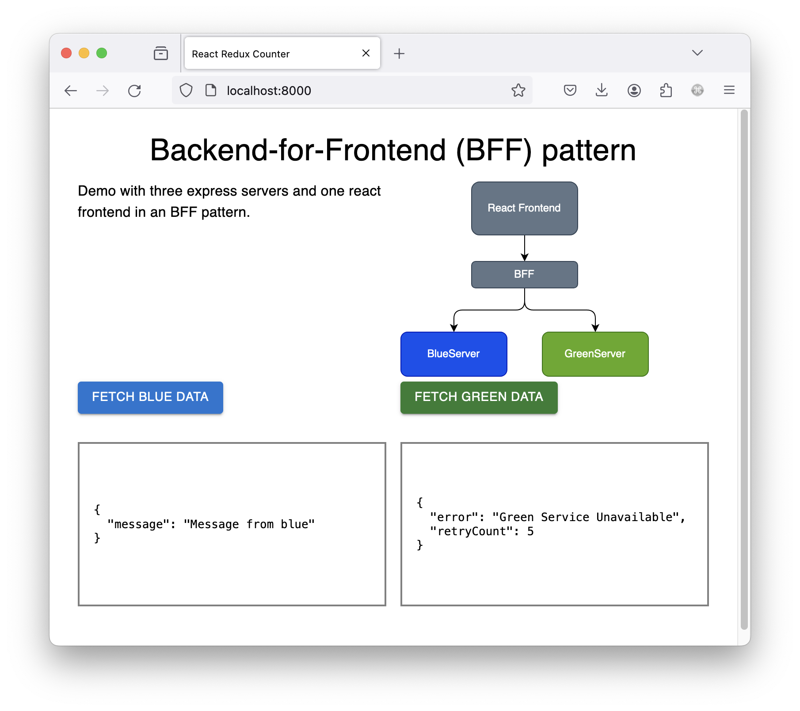

# Overview
This testing approach is mocking request with the nock framework to test axios-retry on the BFF server.

```
         +----------------+
         |                |
         | React Frontend |
         |                |
         +-------+--------+
                 |
                 |
                 |
           +-----v-----+
           |    BFF    |
           +-----+-----+
                 |
       +---------+-----------+
       |                     |
       |                     v
+------v------+       +------+-------+
|             |       |              |
| BlueServer  |       |  GreenServer |
|             |       |              |
+-------------+       +--------------+
```

# Frontend


# Jest sample test
```js
describe('blue-retry', () => {
  nock('http://localhost:8001').get('/message').replyWithError('500');
  nock('http://localhost:8001').get('/message').replyWithError('500');
  nock('http://localhost:8001').get('/message').reply(200, { message: 'Message from blue mock' })

  it('should retry three times', async () => {

    const res = await fetchBlueData(); // 200

    expect(res.status).toBe(200);
    expect(res.config['axios-retry'].retryCount).toBe(2);
  });
});
```


# What http error code should an bff server respond on ECONNREFUSED?

When the underlying API connection results in an ECONNREFUSED error, it typically indicates that the server refused the connection. In such cases, the appropriate HTTP error code for the backend for frontend (BFF) server to respond with would be a 503 Service Unavailable error.

The HTTP 503 status code indicates that the server is currently unable to handle the request due to temporary overload or maintenance. This aligns with the situation where the underlying API server is refusing connections due to some issue on its end.

By returning a 503 error, the BFF server communicates to the client that the service is temporarily unavailable, and the client may try the request again later. This allows for graceful handling of the error and informs the client that the issue is not permanent.
